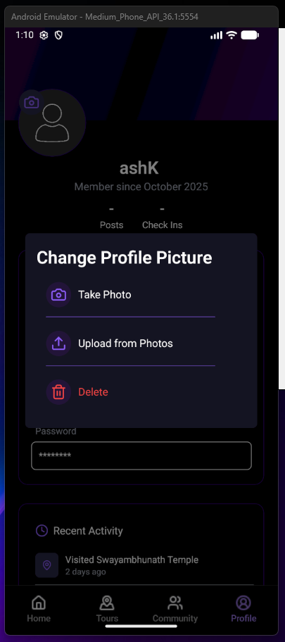
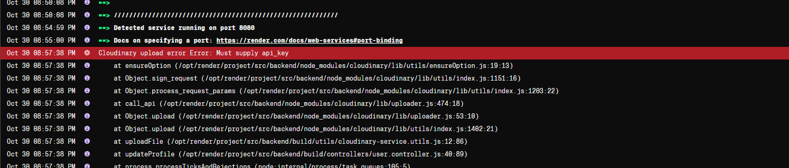
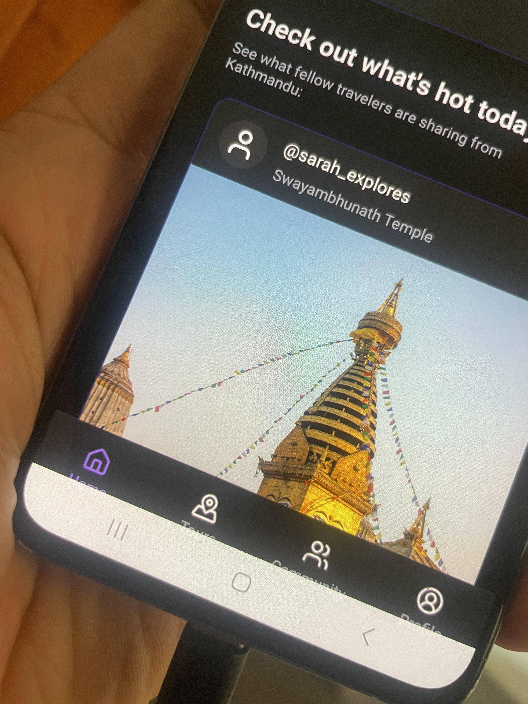
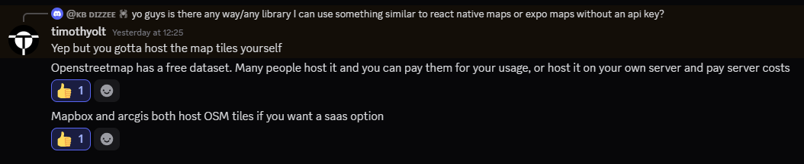
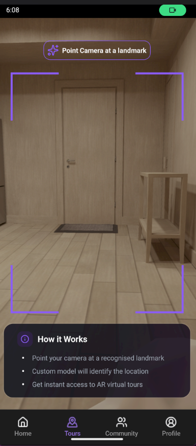
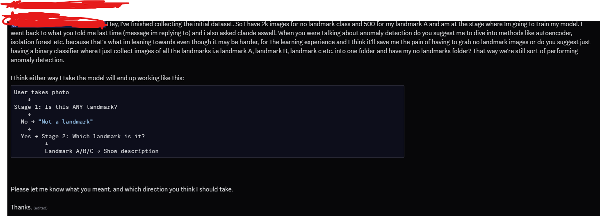
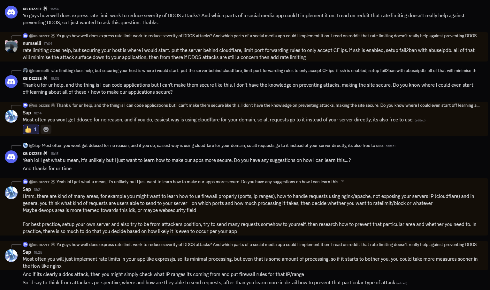
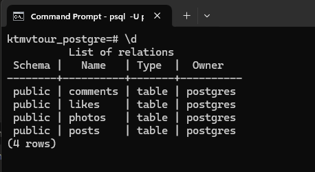
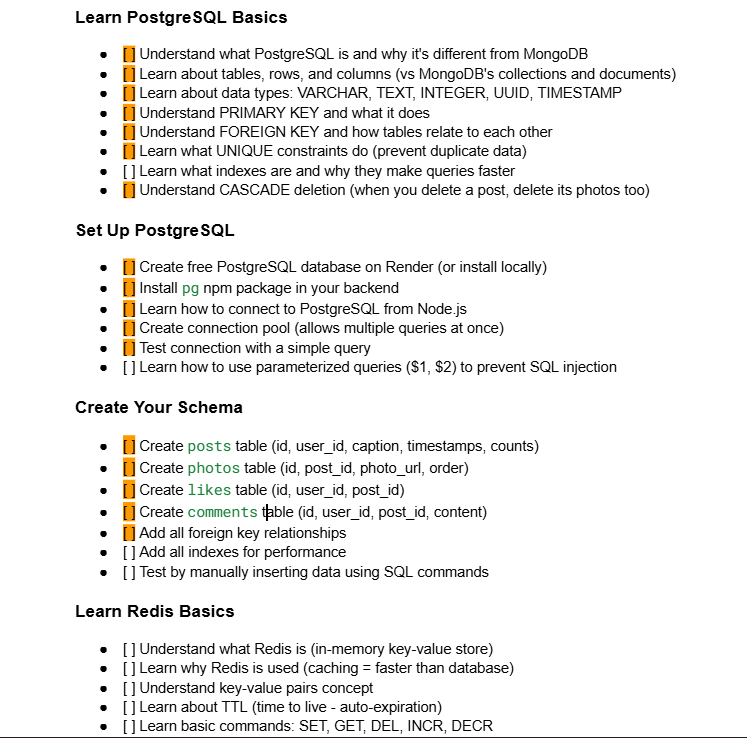

## 30 Sept 25

- Initialised folder structure.
- Added photos of the two landmarks using ICrawler.
- Watched a video on transfer learning using TensorFlow + mobilenetv2 from code basics.
- setup the transfer learning in training-model.py file using tensor flow

## 1 Oct 25

- Continued working through traning-model.py transfer learning
- currently getting typeerror problem:

```bash
  Traceback (most recent call last):
  File "c:\Users\ashut\Desktop\KTMVTour\ml-model\models\training-model.py", line 149, in <module>
  model = tf.keras.Sequential([
  ^^^^^^^^^^^^^^^^^^^^^
  File "C:\Users\ashut\Desktop\KTMVTour\ml-model\venv\Lib\site-packages\keras\src\models\sequential.py", line 75, in **init**
  self.add(layer, rebuild=False)
  File "C:\Users\ashut\Desktop\KTMVTour\ml-model\venv\Lib\site-packages\keras\src\models\sequential.py", line 97, in add
  raise ValueError(
  ValueError: Only instances of `keras.Layer` can be added to a Sequential model. Received: <tensorflow_hub.keras_layer.KerasLayer object at 0x000001E2F98C0F10> (of type <class 'tensorflow_hub.keras_layer. KerasLayer'>)
```

- I wrote about how I solved it here on github (https://github.com/tensorflow/tensorflow/issues/63849#issuecomment-3354405639):
  

- Btw the lambda layer wraps a function and does not declare its input shape. Previously our hub.KerasLayer declared the input shape, so TensorFlow could build model right away.
  but with lamda, we need to tell the model what kind of input shape its taking by just declaring it like this: tf.keras.layers.InputLayer(input_shape=(img_height,img_width, 3)), e.g (224,224,3)

- Completed model training:
  
  

-Exported model, now starting to test the model.

-when testing the model it turns out that since i used lambda to resolve the sequential access problem i have to import the mnodel using safe_mode=false.

- That's fine, I did that, but then boom run into another error saying:

```bash
Traceback (most recent call last):
  File "c:\Users\ashut\Desktop\KTMVTour\ml-model\models\testing-model.py", line 26, in <module>
    predictions = myModel.predict(img)
                  ^^^^^^^^^^^^^^^^^^^^
  File "C:\Users\ashut\Desktop\KTMVTour\ml-model\venv\Lib\site-packages\keras\src\utils\traceback_utils.py", line 122, in error_handler
    raise e.with_traceback(filtered_tb) from None
  File "c:/Users/ashut/Desktop/KTMVTour/ml-model/models/training-model.py", line 153, in <lambda>
    # Keras Sequential API is a way to build your neural network by lining up layers in order, like a stack of Lego blocks.
                                       ^^^^^^^^^^^^^^^^^^^^^^^
NameError: Exception encountered when calling Lambda.call().

name 'feature_extractor_layer' is not defined

Arguments received by Lambda.call():
  • inputs=tf.Tensor(shape=(1, 224, 224, 3), dtype=float32)
  • mask=None
  • training=False
```

-now im trying to remove the lambda and get it working again.

- RAHH Finally solved error using this peice:

```bash
version_fn = getattr(tf.keras, "version", None)
if version_fn and version_fn().startswith("3."):
  import tf_keras as keras
else:
  keras = tf.keras
```

- I did see this before & try it but I didn't change all my tf.keras imports to keras thats why it wasn't working.
- I loaded up a simple test script from grok as a sample & it worked:

  

- Ok right, damn when doing testing even if I put a pic of my face it's still guessing between the two landmarks.
- I need to get the accuracy on this thing up. faaaaking hell yeah i gotta get like 700 images each for 2 landmarks & they have to be realistic.
- Ok im only doing this project for 2 landmarks, and i need to add a class called no-landmark & add maybe like 2k images
- of just random shit so model can differentiate between landmark and other bullshit.

## 1 Oct 25

- got to 200 images for landmark a for now
- removed ICrawler scripts + photos

## 2 Oct 25

- Spent the day grabbing some more photos of landmark.

## 3 Oct 25

- for now the plan is to get some more photos. Maybe if I can get 400 photos by end of today & then use data augmentation.
- maybe start on the frontend aswell?
- creating home page layout/design using figma.
- Initialised expo project

## 4 Oct 25

- plan for today is to continue grabbing images for dataset & also get some sections of the frontend styling on app complete.
- Following along with this tutorial to get an idea of how native works + some tips: https://www.youtube.com/watch?v=f8Z9JyB2EIE

## 5 Oct 25

- continued grabbing some more images + working on site home

## 6 Oct 25

- I didn't even grab any images today, I basically got 500 for first landmark, may just use data augmentation to make total like 800.
- Spent some time doing my other assignment today + been learning dsa + git workflows + aws these past couple of days.
- regardless, the frontend styling for home page isn't even gonna take long so it's fine. I may also just start on the backend on node aswell soon.
- after i finish training my model & importing the AR part, project is just about making use of location APIs, from there it's just basic crud APIs.
- not much significant errors encountered so far on react native, guess it's basically same as react tho that's why. Just syntax confusion.

## 7 Oct 25

- Filtered out useless images from second landmark folder
- Plan for today is to grab images of second landmark & get some frontend done + setup backend folders.
- I'll also dive into what db I should use, mongo should do but lets see.

- Ok i ran into sort of a positioning issue, I was trying to use absolute positioning like this on my icon:

```TypeScript
          <MapPin
            size={24}
            color={"#8B5CF6"}
            className="absolute top-[20%] left-[10%] animate-pulse"
          />
          <MapPin
            size={24}
            color={"#8B5CF6"}
            className="absolute bottom-[10%] left-[15%] animate-pulse"
          />
          <MapPin
            size={24}
            color={"#8B5CF6"}
            className="absolute top-[10%] right-[10%] animate-pulse"
          />
```

instead needded to do it like this:

```TypeScript
          <View className="flex flex-col items-center justify-center">
            <Map size={60} color={"#8B5CF6"}/>
            <Text className="text-secondary animate-pulse">
              Interactive map loading...
            </Text>
          </View>
          <View className="absolute top-12 left-12 animate-pulse">
            <MapPin size={24} color={"#8B5CF6"} />
          </View>
          <View className="absolute bottom-12 left-8 animate-pulse">
            <MapPin size={24} color={"#8B5CF6"} />
          </View>
          <View className="absolute top-8 right-8 animate-pulse">
            <MapPin size={24} color={"#8B5CF6"} />
          </View>
```

- didn't get any images of second landmark today, and just completed half the card.
- need to speed this up. Gotta get a lot more done tomorrow. Only 1 leetcode tomorrow morning & just focus on dataset + frontend.

## 8 OCT 25

- Got Database setup on mongo, gathered only like 20 no landmark images.
- look into anomaly detection tomorrow, somehow maybe I can avoid having to fetch 2k images. Link for a video: https://www.youtube.com/watch?v=2K3ScZp1dXQ
- backend is ready to go now, initial files setup controllers ready to be made.
- spent a while on devinterview.io today skimming through 10 js & 10 ts questions. I'll aim to do 10 a day if I can..
- also got more of the frontend home page styling setup aswell

## 9 OCT 25

- Did the posts section. Had a bit of trouble with overflowing issue because of one h-screen element on parent View tag.
- No images collected.

## 10 OCT 25

- Created the share your experience card styling.
- Grabbed 100 images. Plan from today is to grab 100 images everyday & then in 20 days i'll be done grabbing 2k images for no landmark class.
- Shoudln't be hard to get 100 images of random things a day.
- Also set up a very basic register function with no password hashing.

## 11 OCT 25

- just writing some errors i encountered while doing the backend:

- forgot to use:

```TypeScript
app.use(express.json()); //used to parse incoming requests with Content-Type: application/json
app.use(express.urlencoded({ extended: true })); //used to parse application/x-www-form-urlencoded data
```

## 12 OCT 25

- got 100 images today of no landmark class
- setup login function boilerplate

## 13 OCT 25

- alright im starting off grabbing 100 images for dataset, if I don't do it first thing I'll probably not do it at all.
- also I need to see if and how we can use cookies for react native.
- god damn, Im in 2 sticky situations;
- Firstly, I can't use react native vision camera with the default expo go app, I need to use development builds or EAS build.
- Secondly, i have somewhat of an idea of what not to do for cookies, but it's still a bit rough man. I may have to send cookies from backend &
  use react-native-cookies library + axios, in frontend if that's even possible.
- ok i think adding the camera will be one of the last things I do. I'll do it when im transitioning into dev build my expo project.
- for now i'll just try to deal with the cookie problem.
- alr faak it imma build the login function and try to connect it to frontend using that cookies library. If it doesn't work, it'll be a lesson for next time.
- completed the backend of login + the 100 dataset images.

- ran across this error:
  

- I checked how we avoided this in class but it was just avoiding the type like this:

```TypeScript
const user:any = ...
```

- It gets rid of the problem, but throws away the point of typescript & type checking.
- maybe this solution i implemented here is a little better, because we still retain our types for everything else?

```TypeScript
  const payload:JWTPayload = {
    _id:user._id as any,
    email:user.email,
    username:user.username,
    profilePicture:user.profilePicture
  }
```

- but maybe it doesn't even matter in the end because our JWTPayload is already setting types to string etc.

## 14 OCT 25

- ok what I want to do for my project today is make sure I have a frontend styling of auth forms and implement different routes for them, e.g so if user clicks community
  or profile it just redirects them to the login page for now + also get the 100 images dataset.

- Ts in stack overflow saved me harrd, had to hide passowrd as it was being input and they dont got type password like react:
  

- finished the 100 images collection

- Big GOAT right here, shoutout my boy (even tho its on RHF RN docs, still helped w the understanding part):
  https://medium.com/@rutikpanchal121/building-a-robust-form-in-react-native-with-react-hook-form-and-zod-for-validation-7583678970c3

- I finished the frontend part with React hook form + yup aswell and now all that's left is just call backend using axios. I'll try doing it with no
  RN cookies library and try to find a bug/error.

- Can't be bothered doing no more, gotta play some fifa tn, gotta go over one leetcode problem & answer some basic react interview q's then continue tomorrow.

## 15 OCT 25

- starting off by grabbing 100 images for my no landmark class. (grabbed almost 3/4 from my camera roll)

- with axios im just using my basic localhost url rn, since I haven't deployed backend. Alright, now it's time to do the react query implementation.

- found a very good recent tutorial that goes over exactly what im trying to do (with react query):
  https://www.youtube.com/watch?v=H0CuK7MPtnI

- using toastify-react-native library for the onSuccess/onError messages.
- Link: https://www.npmjs.com/package/toastify-react-native

- Im running into these errors, because I think i put the .ts files in my app folder and im thinking its being included in a route defintion inside the app folder:

```bash
 WARN  Route "./api/auth.api.ts" is missing the required default export. Ensure a React component is exported as default.
 WARN  Route "./schema/auth.schema.ts" is missing the required default export. Ensure a React component is exported as default.
 WARN  Route "./types/auth.types.ts" is missing the required default export. Ensure a React component is exported as default.
```

- Yeah that should be the problem, i looked on stack overflow and have other people saying the same thing,:
  

- I created a src folder with the api, schema + types folders within it, basically anything that was not tsx file.
- Since the folders are moved elsewhere, im a little skeptical about the layout file in which I wrapped it with my queryclientprovider + toastmanager,
  but I think it should be fine.

- hmm so there are no errors logged but app still isn't working because of an error

- ahh yes, the problem is in the layout file in which I had this:

```TypeScript
import { Stack } from "expo-router";
import "./globals.css";
import { QueryClient, QueryClientProvider } from "@tanstack/react-query";
import ToastManager from "toastify-react-native";

// Create a client
const queryClient = new QueryClient();

export default function RootLayout() {
  return (
    //wrapping out app with the queryClientProvider
    <QueryClientProvider client={queryClient}>
      <ToastManager>
        <Stack>
          <Stack.Screen name="(tabs)" options={{ headerShown: false }} />
        </Stack>
      </ToastManager>
    </QueryClientProvider>
  );
}
```

- changing it to this again, makes it work but then when I try to access the temporary login page it tells me no queryclient set:

```TypeScript
import { Stack } from "expo-router";
import "./globals.css";
import { QueryClient, QueryClientProvider } from "@tanstack/react-query";

export default function RootLayout() {
  return (
    <Stack>
      <Stack.Screen name="(tabs)" options={{ headerShown: false }} />
    </Stack>
  );
}
```

- i'll try structuring the query client provider within the stack
- still not working like this aswell:

```TypeScript
    <Stack>
      <QueryClientProvider client={queryClient}>
        <ToastManager>
          <Stack.Screen name="(tabs)" options={{ headerShown: false }} />
        </ToastManager>
      </QueryClientProvider>
    </Stack>
```

- there's also another error that says:

```TypeScript
  //cant perform react state update on a component that hasn't mounted yet. This indicates that you have a side-effect in your render function that asynchronously later calls tries to update the component. Move this work to useEffect instead.
```

- ok i found the problem for the first error, it wasn't with queryclient provider it was with the toast manager instead, because my project is working well like this:

```TypeScript
import { Stack } from "expo-router";
import "./globals.css";
import { QueryClient, QueryClientProvider } from "@tanstack/react-query";

// Create a client
const queryClient = new QueryClient();

export default function RootLayout() {
  return (
    //wrapping out app with the queryClientProvider
    <QueryClientProvider client={queryClient}>
      <Stack>
        <Stack.Screen name="(tabs)" options={{ headerShown: false }} />
      </Stack>
    </QueryClientProvider>
  );
}
```

- Okay I set the toastmanager tag in my login form where toast is being used and that solved my problem.

- Now the login form is working, but when im entering correct details it says login failed still.

- ahh, the error message is saying cannot read property data of undefined. I think the inputs aren't being sent properly to the backend function.

- using our clg statement, i can clearly see that the correct data is being submitted. it logs the email + password being submitted.:

```TypeScript
  const onSubmit = async(data:ILoginData) => {
    console.log('Submit data:', data);
    mutate(data)
  };
```

- It's mad weird because it's working on postman but not my expo app. Maybe not having the deployed backend is a problem?

- okay look:

```TypeScript
    if (err?.response) {
      throw err.response.data;
    } else {
      throw new Error('Network or Server Error');
    }
```

- I'm hitting toast message that says network or server error. I 100% think it's a problem with the url not being read properly
  by react native since im using local host, so it doesn't recognise my backend. I will deploy my backend on render + style the toast messages and then it should work.

- deployed my site on render and connected it to frontend by creating axios instance, but ran into this error:

```bash
iOS Bundling failed 1612ms node_modules\expo-router\entry.js (3242 modules)
The package at "node_modules\dotenv\lib\main.js" attempted to import the Node standard library module "path".
It failed because the native React runtime does not include the Node standard library.
Learn more: https://docs.expo.dev/workflow/using-libraries/#using-third-party-libraries
  1 | const fs = require('fs')
> 2 | const path = require('path')
    |                       ^
  3 | const os = require('os')
  4 | const crypto = require('crypto')
  5 | const packageJson = require('../package.json')

Import stack:

 node_modules\dotenv\lib\main.js
 | import "path"

 src\api\index.ts
 | import "dotenv"

 src\api\auth.api.ts
 | import "./index"

 app\components\auth\login.form.tsx
 | import "@/src/api/auth.api"

 app\(tabs)\profile.tsx
 | import "../components/auth/login.form"

 app (require.context)
```

- apparently you don't need dotenv or anyting, in expo projects u can just make sure your variables start with EXPO*PUBLIC* & use process.env in ur files , the expo docs said this:

```TypeScript
//The Expo CLI will automatically load environment variables with an EXPO_PUBLIC_ prefix from .env files for use within your JavaScript code whenever you use the Expo CLI, such as when running npx expo start to start your app in local development mode.
```

- hmmm it's connected to render now but it's still not logging me in

- ahhh I see the problem now, i forgot to add accessible for any ip in mongodb account:
  

- ok that problem is fixed, I can login now finally, but I think process.env.EXPO_PUBLIC_API_BASE_URL isn't returning correct url because when i do axios.post('myurl') it works but not when I do api.post('/auth/login').

- I just added it in extra inside of app.json and then imported the expo constants in the instance file like this:

```TypeScript
// using this file to create an instance
import axios from "axios";
import Constants from 'expo-constants';

const apiBaseUrl = Constants.expoConfig?.extra?.apiBaseUrl
const instance = axios.create({
  baseURL: apiBaseUrl,
  withCredentials:true
})

export default instance
```

- Im reading more about how I should store data and MMKV seems like a good storage since, it's similar to asyncStorage but allows you to encrypt your data aswell.
  So it's good for storing more sensitive data aswell. But anyways, that should be good enough for today. I'll continue tomorrow. Tomorrow if I can get the user stored
  using MMKV and make sure to add protected route to the whole app. Essientially, the user must create an account to use the app. Originally I was thinking maybe we let user
  see home page + tour landmarks without logging in but nah, it's just much more efficient if user is logged in before even accessing anything. Ok, i also got an idea, once we
  give the user a virtual tour of a landmark it should feature an end screen that prompts them to share their experience (in other words post a picture of them @ the landmark)

## 16 OCT 25

- Ok mmkv is a drag you have to setup dev build, eas, expo dev account etc. I'm watching this tutorial with JWT auth: https://www.youtube.com/watch?v=uP9SGbglMe4

- Ok i made sure the entire app is protected using expo router within layout file, it's just a simple test script for now:

```TypeScript
import { Stack } from "expo-router";
import "./globals.css";
import { QueryClient, QueryClientProvider } from "@tanstack/react-query";

// Create a client
const queryClient = new QueryClient();
const isAuthenticated = false

export default function RootLayout() {
  return (
    //wrapping out app with the queryClientProvider
    <QueryClientProvider client={queryClient}>
      <Stack>
        <Stack.Protected guard={isAuthenticated}>
          <Stack.Screen name="(tabs)" options={{ headerShown: false }} />
        </Stack.Protected>
      </Stack>
    </QueryClientProvider>
  );
}
```

- This makes it so that you must be logged in to access the app.

- It's working well but it's showing like a white navbar with the page name, i need to get rid of that:
  

- This was as simple as setting showHeader false:

```TypeScript
  <Stack.Protected guard={!isAuthenticated}>
    <Stack.Screen name="login" options={{headerShown: false}}/>
    <Stack.Screen name="signup" options={{headerShown: false}}/>
  </Stack.Protected>
```

- Initialised a signup page, need to style it later and make it work:
  

- following that JWT tutorial & installing zustant + mmkv. I tried to do npx expo prebuild & this is the error it gave me:

```bash
PS C:\Users\ashut\Desktop\KTMVTour\frontend\KTMVTour> npx expo prebuild
› Android package name: com.anonymous.KTMVTour
√ Created native directory
√ Updated package.json
× Prebuild failed
Error: [android.dangerous]: withAndroidDangerousBaseMod: ENOENT: no such file or directory, open 'C:\Users\ashut\Desktop\KTMVTour\frontend\KTMVTour\assets\images\splash-icon.png'
Error: [android.dangerous]: withAndroidDangerousBaseMod: ENOENT: no such file or directory, open 'C:\Users\ashut\Desktop\KTMVTour\frontend\KTMVTour\assets\images\splash-icon.png'
    at Object.openSync (node:fs:562:18)
    at Object.readFileSync (node:fs:446:35)
    at calculateHash (C:\Users\ashut\Desktop\KTMVTour\frontend\KTMVTour\node_modules\@expo\image-utils\build\Cache.js:19:76)
    at createCacheKey (C:\Users\ashut\Desktop\KTMVTour\frontend\KTMVTour\node_modules\@expo\image-utils\build\Cache.js:24:18)
    at Object.createCacheKeyWithDirectoryAsync (C:\Users\ashut\Desktop\KTMVTour\frontend\KTMVTour\node_modules\@expo\image-utils\build\Cache.js:32:33)
    at generateImageAsync (C:\Users\ashut\Desktop\KTMVTour\frontend\KTMVTour\node_modules\@expo\image-utils\build\Image.js:227:34)
    at process.processTicksAndRejections (node:internal/process/task_queues:105:5)
    at async C:\Users\ashut\Desktop\KTMVTour\frontend\KTMVTour\node_modules\@expo\prebuild-config\build\plugins\unversioned\expo-splash-screen\withAndroidSplashImages.js:177:11
    at async Promise.all (index 0)
    at async setSplashImageDrawablesForThemeAsync (C:\Users\ashut\Desktop\KTMVTour\frontend\KTMVTour\node_modules\@expo\prebuild-config\build\plugins\unversioned\expo-splash-screen\withAndroidSplashImages.js:162:3)
PS C:\Users\ashut\Desktop\KTMVTour\frontend\KTMVTour>
```

- Ok so I knew it was saying it couldn't find a file named splash-icon.png. I searched up what is splash icon and it turns out it's what the user sees when the app is intially loading.
- I'll go on figma and quickly create this. BTW, it's only creating an andriod folder so far when I run npx expo prebuild so idk what's up with that.

- splash screen done, I will now go and use EAS build, very good tutorial walking through the process of actually getting the app running
  from expo youtube channel: https://www.youtube.com/watch?v=FdjczjkwQKE

- man wtf is this, to even create an apple dev account u need to pay $150 a year. Im gonna have to run an andriod emulator on pc and install it there because it's free on andriod
  apparently.

- finally got the dev build working on andriod. I can run my own app now. Task for tomorrow now is to make sure I get the auth all setup.

- Ahh, im working tomorrow so yeah, I won't be able to get much done. Hopefully just zustand + mmkv setup and then saturday I should be
  able to finish profile page completely, or at least get a lot done.

## 17 OCT 25

- Ok when setting up the auth store I ran into a problem for a while because of some silly mistake(the is authenticated was outside function root layout):

```TypeScript
import { Stack } from "expo-router";
import "./globals.css";
import { QueryClient, QueryClientProvider } from "@tanstack/react-query";
import { useAuthStore } from "@/src/store/auth.store";

// Create a client
const queryClient = new QueryClient();
// Successfully created authstore using zustand
const {isAuthenticated} = useAuthStore()

export default function RootLayout() {
  return (
    //wrapping out app with the queryClientProvider
    <QueryClientProvider client={queryClient}>
      <Stack >
        <Stack.Protected guard={isAuthenticated}>
          <Stack.Screen name="(tabs)" options={{ headerShown: false }} />
        </Stack.Protected>
        <Stack.Protected guard={!isAuthenticated}>
          <Stack.Screen name="login" options={{headerShown: false}}/>
          <Stack.Screen name="signup" options={{headerShown: false}}/>
        </Stack.Protected>
      </Stack>
    </QueryClientProvider>
  );
}
```

I changed it to this and it worked (also when calling handleLogin function in onSuccess, it should be handlelogin() not handlelogin):

```TypeScript
import { Stack } from "expo-router";
import "./globals.css";
import { QueryClient, QueryClientProvider } from "@tanstack/react-query";
import { useAuthStore } from "@/src/store/auth.store";

// Create a client
const queryClient = new QueryClient();

export default function RootLayout() {
  // Successfully created authstore using zustand
  const { isAuthenticated } = useAuthStore();

  return (
    //wrapping out app with the queryClientProvider
    <QueryClientProvider client={queryClient}>
      <Stack>
        <Stack.Protected guard={isAuthenticated}>
          <Stack.Screen name="(tabs)" options={{ headerShown: false }} />
        </Stack.Protected>
        <Stack.Protected guard={!isAuthenticated}>
          <Stack.Screen name="login" options={{ headerShown: false }} />
          <Stack.Screen name="signup" options={{ headerShown: false }} />
        </Stack.Protected>
      </Stack>
    </QueryClientProvider>
  );
}
```

- ok I think i figured it out, storing mmkv is the exact same with how I did it in my localstorage in previous web project.
  So to store the user + access token in mmkv within the onSuccess in mutation fn I just set it like this(checked for correct output using logs):

```TypeScript
  console.log(`Response data {user}: ${JSON.stringify(response.data)}`)
  console.log(`Access token response:${response.KTMVTour_token}`)
  storage.set('user',JSON.stringify(response.data))
  storage.set('KTMVTour_token',response.KTMVTour_token)
```

- I need to revisit the tutorial from class and see how we handled our localstorage stuff and then replicate that and it should be working.

- I asked chatgpt how I could access the user from mmkv storage & it said I needed these lines in the doc I was trying to access it on:

```TypeScript
interface User {
  username: string;
  id: string;
  email: string;
}

// all this inside component function
  const [user, setUser] = useState<User | null>(null);
  const storage = new MMKV();

  useEffect(() => {
    const storedUser = storage.getString("user");
    if (storedUser) {
      setUser(JSON.parse(storedUser));
    }
  }, []);
```

- Its simple logic, I get what it's doing but i will have to repeat myself for every page I want to access the user info.
- there must be a better way to do this than to repeat myself for every page. It's not too important for now, but maybe come
  back to it later and find a better solution.

- also removed the tokens on logout(used log statement to confirm user was null after logout), note password is never even stored in all of this because my backend function doesn't even send password in response. It just hashes it and saves it do db and db only.:

```TypeScript
const handlelogout = () => {
  storage.delete('user')
  storage.delete('KTMVTour_token')
  logout()
  // console.log(user)
};
```

- all right, that's it closing off today. Tomorrow I need to watch the video on how we saved our storage on page refresh and apply that
  to this app so user doesn't have to keep logging in on reload of app. I should be good in completing functional signup page tomorrow
  and getting frontend styling of profile page done. After I get profile page working, I should be fine in setting up the styling/basic
  idea of tours page with react native vision camera + some text. Also just add an alert saying, we only offer tour for one landmark rn.

## 18 OCT 25

- ahh im going over that JWT tutorail in RN and i think i get it, now. If i create a store file then I don't have to keep calling the state + effect hooks and I can also save my auth state even on reloading.

- i followed the code in the tutorial & it wasn't saving the state on reloading. I asked chat gpt it said within my checkAuth function,
  I should have these lines and it fixed the problem:

```TypeScript
 if (authUserData && authTokenData) {
    set({ isAuthenticated: true });
    return true;
  }

  set({ isAuthenticated: false });
  return false;
```

- instead of:

```TypeScript
if(authUserData && authTokenData){
    set(authTokenData,authUserData)
    return true
  }

  return false
```

- next I have to figure out how to access the user name etc. now

- fk that, I can't get much done today im short on time. I'l just try to style much of the signup page as I can.

- ahh, I got the signup with full functionality within 5 mins, because it was basically copy paste of login + one more field and another function from backend that needed to be changed.

- updated profile tsx to have just getItem('user') instead of the state + effect hook I had yesterday, so the solution to the problem I was looking for yesterday is set.

- alright thats a close off for today, tomorrow I'll build the full profile page, or at least do as much as I can. Also im thinking we have a plus icon in our tabs (in the middle) that links us to a post screen. Just like tiktok, otherwise user's have to go through more of a search to try & find the post button which will just turn them away from posting.

## 19 OCT 25

- Couldn't do much, was out basically whole day. But I managed to finish half of the profile page styling

## 20 OCT 25

- Finished off the profile page styling to start off with. I ran into an overflow issue because i was using h-[20%] for the linear bg in profile page, but switching it to h-48 or 44 whatever it was + adding scrollview component ended up fixing the issue.

- I'll see if I can add some backend functionality to the profile page today.

- Didn't get to adding backend functionality, just worked some more on the frontend, adding states when user clicks edit on profile page etc.

## 21 OCT 25

- I'll start off by creating an update profile backend function.

- Ok so I just tried to use req.user.\_id and I couldn't use it because I didn't have an auth middleware function so I got an error saying cannot read properties of undefined reading id. I also had to create an express.d.ts docs:

```TypeScript
import { Request } from 'express';
import { JWTPayload } from './global.types';

declare global {
  namespace Express{
    interface Request{
      user:JWTPayload
    }
  }
}
```

- i created the auth middleware and now its saying:

```bash
Error handler caught: TypeError: Cannot read properties of undefined (reading 'KTMVTour_token')
    at C:\Users\ashut\Desktop\KTMVTour\backend\src\middlewares\auth.middleware.ts:15:42
    at Layer.handleRequest (C:\Users\ashut\Desktop\KTMVTour\backend\node_modules\router\lib\layer.js:152:17)
    at next (C:\Users\ashut\Desktop\KTMVTour\backend\node_modules\router\lib\route.js:157:13)
    at Route.dispatch (C:\Users\ashut\Desktop\KTMVTour\backend\node_modules\router\lib\route.js:117:3)
    at handle (C:\Users\ashut\Desktop\KTMVTour\backend\node_modules\router\index.js:435:11)
    at Layer.handleRequest (C:\Users\ashut\Desktop\KTMVTour\backend\node_modules\router\lib\layer.js:152:17)
    at C:\Users\ashut\Desktop\KTMVTour\backend\node_modules\router\index.js:295:15
    at processParams (C:\Users\ashut\Desktop\KTMVTour\backend\node_modules\router\index.js:582:12)
    at next (C:\Users\ashut\Desktop\KTMVTour\backend\node_modules\router\index.js:291:5)
    at Function.handle (C:\Users\ashut\Desktop\KTMVTour\backend\node_modules\router\index.js:186:3)
```

- I will try to install cookie parser see if that helps or maybe its because my site is in development instead of production or whateever so that makes secure true instead of false or the other way around I forgot.

- Ok changing the env to production didn't work so i think it's the cookie parser problem. Let's install cookie parser and see.

- yes, not having cookie parser was the problem. Okay, now the backend for update profile is done.

- i'll probably implement this into frontend tomorrow, i may just close off for today here.

## 22 OCT 25

- starting off by connecting the backend update profile function with the frontend.

- Ok im facing two issues right now. The first one is when im trying to display error message:

```TypeScript
{errors.email && (
            <Text className="text-red-500 text-xs pl-8 mt-1">
              {errors.email.message}
            </Text>
          )}
```

- This is the error it says:

```TypeScript
No overload matches this call.
  Overload 1 of 2, '(props: TextProps): Text', gave the following error.
    Type 'string | FieldError | Merge<FieldError, FieldErrorsImpl<any>> | undefined' is not assignable to type 'ReactNode'.
      Type 'FieldError' is not assignable to type 'ReactNode'.
        Type 'FieldError' is missing the following properties from type 'ReactPortal': children, props, key
  Overload 2 of 2, '(props: TextProps, context: any): Text', gave the following error.
    Type 'string | FieldError | Merge<FieldError, FieldErrorsImpl<any>> | undefined' is not assignable to type 'ReactNode'.
      Type 'FieldError' is not assignable to type 'ReactNode'.
        Type 'FieldError' is missing the following properties from type 'ReactPortal': children, props, keyts(2769)
Text.d.ts(114, 3): The expected type comes from property 'children' which is declared here on type 'IntrinsicAttributes & IntrinsicClassAttributes<Text> & Readonly<TextProps>'
Text.d.ts(114, 3): The expected type comes from property 'children' which is declared here on type 'IntrinsicAttributes & IntrinsicClassAttributes<Text> & Readonly<TextProps>'
(property) message?: string | FieldError | Merge<FieldError, FieldErrorsImpl<any>> | undefined
```

- The second error is because of my default values for username + email in my RHF, when I try to change the values, it just cancels what I wrote after like half a second and adds back the original default values. I asked chat gpt, apparently we can solve this with a useEffect hook and using the reset function within RHF, but i'll search online for it aswell lets see. Ahh ha, i asked gpt, claude and grok. Claude gave me the same solution as the other two, but it gave me a much simpler + quicker solution aswell. It told me to change onChange which is more suited for web and not react native to onChangeText = {onChange} and that ended up fixing the issue. Ok so that's one issue done, the other issue i have is about that type error & I also can't seem to submit form/make request to backend when i click save so let's see whats going on there aswell.

- AHHH HAHAH i forgot to deploy this shit on the backend to render. It just came in my mind as soon as I was going to check the error logs on render.

- and in terms of my errors.email.message error, i just replaced it like this for now(since im pretty sure the only error that we can get on it is Invalid email format. But anyways, i may fix that later if I find a good solution.):

```TypeScript
{errors.email && (
            <Text className="text-red-500 text-xs pl-8 mt-1">
              Invalid Email Format
            </Text>
          )}
```

- re deploying it didn't fix problem.

- Yo yo yo, I added all these debugging statements and I think it was a problem with the fking react native restart library:

```bash
 LOG  Form Submitted {"email": "ashutoshkuinkel42@gmail.com", "username": "ashK"}
 LOG  About to call mutate
 LOG  Mutate called
 LOG  Success response: {"data": null, "message": "Profile Updated"}
 LOG  Error occurred: [TypeError: Cannot read property 'restart' of null]
```

- Bombooclaat I think it's because i need to rebuild app after importing the RNrestart for it to work. Let me just remove the rn restart for now. Ok, so the data is getting updated on the database when I make a change on my app, but i think the problem is because the app is using the token which has the old data stored. Hence, it's showing the old data instead of the new changed data. I asked claude, it said this was the problem, and it suggested me to set a new token with the updated data once user updates profile like this:

```TypeScript
const onSubmit = (data: IUser) => {
 const payload: Partial<IUser> = {};

 if (data.username !== user.username) {
   payload.username = data.username;
 }
 if (data.email !== user.email) {
   payload.email = data.email;
 }
 if (data.password && data.password.trim() !== "") {
   payload.password = data.password;
 }

 console.log(`Form Submitted (only changed fields):`, payload);

 if (Object.keys(payload).length === 0) {
   Toast.error("No changes detected", "top");
   return;
 }

 mutate(payload as IUser);
};

const { mutate, isPending } = useMutation({
 mutationFn: updateProfileAPI,
 mutationKey: ["update_profile_key"],
 onSuccess: (response, variables) => { // variables contains the payload you sent
   // Update local storage with new values
   const currentUser = getItem("user");
   const updatedUser = {
     ...currentUser,
     ...variables, // The payload from mutate()
   };

   setItem("user", updatedUser); // Make sure to import setItem from your storage

   Toast.success(response?.message ?? "Profile Updated", "top");
   setIsEditing(false);
 },
 onError: (err) => {
   console.log("Error occurred:", err);
   Toast.error(
     err?.message ?? "Error updating profile. Please try again later.",
     "top"
   );
 },
});
```

- This will probably work but how scalable is this? let's say im fetching a users posts right, will I have to set a new token every time user posts aswell? or sends a comment on the app etc.? Maybe for now i guess I can just remove the user/token so user needs to login again after they make a change to their profile info. But then again, will I have to do the same with posting, commenting etc. for it to take effect? Oh well, I'll worry about that when doing it. For now this is a temporary solution. I need to come back to it, it's important to fix this.

- ahh problem after problem, but its fine i guess. The toast messages aren't showing at all for the upate profile. I moved the toast manager + toast config style initialisation to layout.tsx, lets see if that works. Im changing from toastify react native to react native toast message. Hopefully that'll work.

- finally toast problem is done. Now I have to look into how we can update everything without having the user have to logout + login again.

- I asked this over on the coding den discord. Im also seeing what AI says, it tells me when I write the same message to it, & it's telling me to maybe just update mmkv key user to new values on success of update profile function. That seems like a good idea, maybe thats not a good way to go about it though? I'll wait for answers on discord aswell while i try to implement the updating mmkv on success:

```bash
hey guys, im currently working on the profile page for my app. But I want to know how I could handle this issue better.

So when user updates their username for example, the request is successful and it does update the username on the database. However, since im using mmkv storage, it doesn't automatically show the changes all over the app. Im 100% sure its because when user logs in i store the user in mmkv storage.  When I change username and save it, it only takes effect after user logs out and logs in again because on logout i delete the storage.

So initially i thought it'd be fine if we just make the user login again every time they change their username or email or password etc. but then i thought this idea may work well for the problem right now, but it's not really scalable because what if the user makes a post or comments on someone elses posts? How can I just get those changes to fetch without having user logout login again. But now im thinking since i only store the user and token in mmkv, i won't need to worry about posts, comments etc. not fetching since they aren't stored with hardcoded values on login. I can't say this with certainty though until I try posting or making comments etc. but thats a job for later.

Now, if the logout login is a solution that works fine and doesn't really effect anything else I will implement it. However, I still don't want user to have to login again everytime they change their username only for example. It's just a bit annoying. I want the user to change username and boom the new data just fetches. I was also thinking maybe we could use react native restart library, but then I realised restarting app won't do anything, because we'll still be using the same user key.

Any ideas on how I can efficiently go about this problem?

Idk, should I update the mmkv storage after updating profile? so I assign user key to the new set of updated values? or is there a better way?
```

- I asked chat gpt, to update storage variables but haha, it's bs. It just wastes a lot of time and gets the answer wrong. I watched a vid on useRef because it told me I needed useRef and the video said useRef does not re-render component like useState does. But chat gpt, still told me to use useRef, i told it why we can't useRef and it then suggested me an alternative talking about how we can access our data that we mutate (our payload in this case) by passing another param to onSuccess function calling it e.g variables and then just do this:

```TypeScript
 onSuccess: (response,variables) => {
      // updating user key to our updated values
      const updatedUser = {...user,...variables}
      setItem('user',updatedUser)}
```

- ok i'll just convert the photos I got from my phone to jpg and then put them in no landmark dataset for the model. Then that's it for today and tomorrow, what i'll do is maybe get only user id stored in user mmkv key and have a profile function to fecth user data and grab some images for the model.

## 23 OCT 25

- after like an hour and some assistance from claude, I finally got the profile function going on in RN. So all im storing in mmkv is just user id. A guy on discord reccomended me that since it'll be better later on and the db should just be the one source of truth.. something along the lines of that.

- Alright, now i'll spend some time gathering more images. And maybe today i'll add feature of when user clicks tours page, they get alert saying our landmark detection feature is still under development and currerntly only works for the one landmark.

## 24 OCT 25

- Ok i didn't collect the images for the model. I'll start off by converting the files from my phone to jpg and then adding react native vision camera.

- Ok i installed vision camera and setup the plugin + app needs camera permission looking @ the docs for rn vision camera and now Im waiting for the 1005 mb build which will take some hours.

- RN Vision camera is successfully installed and the build is completed I think. That's it for today, tomorrow I will try setting up the tours page.

## 25 OCT 25

- Ain't no way I just did a rebuild this morning because vision camera wasn't working properly and now I gotta do a rebuild again for expo location. I did add the take me to landmark function though, so when user clicks take me to nearby landmark button, it opens up maps with the search label Landmarks near me.

- It's all good today I got the take me to nearby landmarks setup and I got the rn vision camera setup but there's some bug saying permission not obtained to use RN vision camera, but it doesn't even ask me for permission like it did with location. Maybe because im using an emulator?? I also got like 100 images for the model today so that's good. And yes, I really had to wait 6 hours for 2 builds today. If I can fix this bug with RN Vision Camera then I should be good with the tours page. Ahh i got the permission easily. I just needed to use the requestPermission hook and call it within a useEffect hook aswell since we're interacting with stuff in the outside world, not being rendered by the function:

```TypeScript
useEffect(() => {
    if (!hasPermission) {
      requestPermission();
    }
  }, [hasPermission]);
```

## 26 OCT 25

- Ok I couldn't see the camera yesterday because I didn't set a height and width. I was just playing around with borderwidth because I thought I wouldn't be able to see the camera on my emulator, so I  just wanted an idea of where the camera would be by setting a border. However i set borderWidth 4 first and then I seen something appear, I increased it more and seen the camera come. So boom then I got it setup.

- With that being said, I was going to ask figma to give me a nice design for my tours page, but it looks like im out of credits until Nov 1. So maybe, i'll just wait until then to style the tours page.

- Ok im just thinking right now and maybe instead of having our take me to nearby landmark button search for automatically route user to first search that comes up when we do take me to nearby landmark. But nah that's not good, because what if user doesn't want to go to that.
I think it's better if we let user decide. So keep it as is for now.

- When i did password select false on my user model I forgot to add select password after like user.findone(id) so bcrypt got undefined/null user password hence why it was throwing the data and hash arguments required.

- I got some images into the dataset aswell today, but now I gotta start gaining an understanding of how I can connect the tf lite model when ready to my rn vision camera. I asked a question on discord about this and some guy responded to me saying:

    It’s just running the model every frame
    If you don’t want to run the model every frame, do a frame by frame comparison like structural similarity index
So now im guessing if I just import the model It'll work how I want it to because it's running the model every frame? Who knows though, i'll have to dive deeper into it later.

## 27 OCT 25

- So im currently getting this error from yesterday: 
```bash
 ERROR  [Invariant Violation: View config not found for component `AIRMap`] 

Call Stack
  invariant (node_modules\invariant\browser.js)
  get (node_modules\react-native\Libraries\Renderer\shims\ReactNativeViewConfigRegistry.js)
  completeWork (node_modules\react-native\Libraries\Renderer\implementations\ReactFabric-dev.js)
  runWithFiberInDEV (node_modules\react-native\Libraries\Renderer\implementations\ReactFabric-dev.js)
  completeUnitOfWork (node_modules\react-native\Libraries\Renderer\implementations\ReactFabric-dev.js)
  performUnitOfWork (node_modules\react-native\Libraries\Renderer\implementations\ReactFabric-dev.js)
  workLoopSync (node_modules\react-native\Libraries\Renderer\implementations\ReactFabric-dev.js)
  renderRootSync (node_modules\react-native\Libraries\Renderer\implementations\ReactFabric-dev.js)
  performWorkOnRoot (node_modules\react-native\Libraries\Renderer\implementations\ReactFabric-dev.js)
  performWorkOnRootViaSchedulerTask (node_modules\react-native\Libraries\Renderer\implementations\ReactFabric-dev.js)

Call Stack
  AIRMap (<anonymous>)
  call (<native>)
  apply (<native>)
  <anonymous> (node_modules\react-native-css-interop\dist\runtime\wrap-jsx.js)
  render (node_modules\react-native-maps\lib\MapView.js)
  call (<native>)
  apply (<native>)
  <anonymous> (node_modules\react-native-css-interop\dist\runtime\wrap-jsx.js)
  InteractiveMapCard (components\landing\interactiveMap-card.tsx)
  call (<native>)
  apply (<native>)
  <anonymous> (node_modules\react-native-css-interop\dist\runtime\wrap-jsx.js)
  Index (app\(tabs)\index.tsx)
  call (<native>)
  apply (<native>)
  <anonymous> (node_modules\react-native-css-interop\dist\runtime\wrap-jsx.js)
  BaseRoute (node_modules\expo-router\build\useScreens.js)
  SceneView (node_modules\@react-navigation\core\lib\module\SceneView.js)
  render (node_modules\@react-navigation\core\lib\module\useDescriptors.js)
  routes.reduce$argument_0 (node_modules\@react-navigation\core\lib\module\useDescriptors.js)
  reduce (<native>)
  useDescriptors (node_modules\@react-navigation\core\lib\module\useDescriptors.js)
  useNavigationBuilder (node_modules\@react-navigation\core\lib\module\useNavigationBuilder.js)
  BottomTabNavigator (node_modules\@react-navigation\bottom-tabs\lib\module\navigators\createBottomTabNavigator.js)
  call (<native>)
  apply (<native>)
  <anonymous> (node_modules\react-native-css-interop\dist\runtime\wrap-jsx.js)
  <anonymous> (node_modules\expo-router\build\layouts\withLayoutContext.js)
  call (<native>)
  apply (<native>)
  <anonymous> (node_modules\react-native-css-interop\dist\runtime\wrap-jsx.js)
  Object.assign$argument_0 (node_modules\expo-router\build\layouts\TabsClient.js)
  call (<native>)
  apply (<native>)
  <anonymous> (node_modules\react-native-css-interop\dist\runtime\wrap-jsx.js)
  layout (app\(tabs)\_layout.tsx)
  call (<native>)
  apply (<native>)
  <anonymous> (node_modules\react-native-css-interop\dist\runtime\wrap-jsx.js)
  BaseRoute (node_modules\expo-router\build\useScreens.js)
  SceneView (node_modules\@react-navigation\core\lib\module\SceneView.js)
  render (node_modules\@react-navigation\core\lib\module\useDescriptors.js)
  routes.reduce$argument_0 (node_modules\@react-navigation\core\lib\module\useDescriptors.js)
  reduce (<native>)
  useDescriptors (node_modules\@react-navigation\core\lib\module\useDescriptors.js)
  useNavigationBuilder (node_modules\@react-navigation\core\lib\module\useNavigationBuilder.js)
  NativeStackNavigator (node_modules\expo-router\build\fork\native-stack\createNativeStackNavigator.js)
  call (<native>)
  apply (<native>)
  <anonymous> (node_modules\react-native-css-interop\dist\runtime\wrap-jsx.js)
  <anonymous> (node_modules\expo-router\build\layouts\withLayoutContext.js)
  call (<native>)
  apply (<native>)
  <anonymous> (node_modules\react-native-css-interop\dist\runtime\wrap-jsx.js)
  Object.assign$argument_0 (node_modules\expo-router\build\layouts\StackClient.js)
  call (<native>)
  apply (<native>)
  <anonymous> (node_modules\react-native-css-interop\dist\runtime\wrap-jsx.js)
  RootLayout (app\_layout.tsx)
  call (<native>)
  apply (<native>)
  <anonymous> (node_modules\react-native-css-interop\dist\runtime\wrap-jsx.js)
  BaseRoute (node_modules\expo-router\build\useScreens.js)
  SceneView (node_modules\@react-navigation\core\lib\module\SceneView.js)
  render (node_modules\@react-navigation\core\lib\module\useDescriptors.js)
  routes.reduce$argument_0 (node_modules\@react-navigation\core\lib\module\useDescriptors.js)
  reduce (<native>)
  useDescriptors (node_modules\@react-navigation\core\lib\module\useDescriptors.js)
  useNavigationBuilder (node_modules\@react-navigation\core\lib\module\useNavigationBuilder.js)
  Content (node_modules\expo-router\build\ExpoRoot.js)
  call (<native>)
  apply (<native>)
  <anonymous> (node_modules\react-native-css-interop\dist\runtime\wrap-jsx.js)
  ContextNavigator (node_modules\expo-router\build\ExpoRoot.js)
  call (<native>)
  apply (<native>)
  <anonymous> (node_modules\react-native-css-interop\dist\runtime\wrap-jsx.js)
  ExpoRoot (node_modules\expo-router\build\ExpoRoot.js)
  call (<native>)
  apply (<native>)
  <anonymous> (node_modules\react-native-css-interop\dist\runtime\wrap-jsx.js)
  App (node_modules\expo-router\build\qualified-entry.js)
  call (<native>)
  apply (<native>)
  <anonymous> (node_modules\react-native-css-interop\dist\runtime\wrap-jsx.js)
  WithDevTools (node_modules\expo\src\launch\withDevTools.tsx)
  ```

- I will try to rebuild app first because I know for rn maps you need to rebuild I haven't done that yet. I also haven't gotten an API key but I think it should work without that, if after rebuild I get some other error I'll try to get an API key for google maps and if that doesn't work im going to have to ask claude. While that's building I need to find something else to work on aswell. I'll probably work on trying to get a profile picture functionality going.

- Ok, so i just learnt about lifting up in react which is when we want to share one state between lets say two components. I needed it in this case because we when user clicks edit on this basic info section, the change profile picture icon should also come up. However, the problem was that the basic info section was a component of its own and the profile + icon was in the profile.tsx file. So i removed state [isEditing,setIsEditing] from basic info section file, moved it into profile.tsx and i passed it down as a prop like this:

```TypeScript
{/* Basic info section */}
          <BasicInfoSection 
            isEditing={isEditing}
            setIsEditing={setIsEditing}
          />
```

- Then in my basic info file, I just passed the prop down like this:
```TypeScript
interface stateTypes{
  isEditing: boolean,
  setIsEditing: Dispatch<SetStateAction<boolean>>
}
const BasicInfoSection = ({isEditing,setIsEditing}: stateTypes) => {
  //rest of code stays same
}
```

- So now, this is all good. I need to setup sort of like an alert option, so when user clicks this change pfp button, it has an alert saying like take photo, choose from gallery, delete profile picture. Then after that, I can look into connecting a library for this then finally handle the backend stuff.

- Btw this is the link from react documentation on sharing state between components: https://react.dev/learn/sharing-state-between-components

- Anyways, that's finished. Tomorrow, i'll have to rebuild app after adding api key for rn maps then I'll also try to finish off the frontend of the profile picture then connect to backend.

## 28 OCT 25 

- Ok im rebuilding app right now after adding the api key, hopefully it'll work. Whilst thats going, let's try setting up profile picture more.

- mann, it's not working. I got the api key, but I know its not working because I didn't enter my card details on gcp. Well, looks like 
we're going to have to use expo maps instead 🤷‍♂️.

- Ok, im on the profile picture part again and I need to rebuild my app again now. Whilst that's going I'll just go through some typescript video or do one of my assessments. Anyways, I think I will have to build again after I import expo maps, so I'll add expo maps then rebuild so I don't have to rebuild later.

## 29 OCT 25

- So I added this "debug" log to test if the function on here was being called at all when we clicked the button:
```TypeScript
const handleTakePhotos = async () => {
    console.log(`Function loaded`)
    try {
      await ImagePicker.requestCameraPermissionsAsync();
      let result = await ImagePicker.launchCameraAsync({
        cameraType: ImagePicker.CameraType.front,
        allowsEditing: true,
        aspect: [1, 1],
        quality: 1,
      });

      if (!result.canceled) {
        await saveImage(result.assets[0].uri);
      }
    } catch (err: any) {
      alert("Error uploading image:" + err.message)
      setChangePfpClicked(false)
    }
  };
```

- When I click the take photo, on here, I can see the log function loaded so the function is getting called. I think the problem is im using the emulator and its bugging out on here that's why. If I try it on an andriod phone I think it'll work:



- I need to figure out how I will get the uri loaded onto the profile picture section to display image user chooses. But for now I'll try seeing if expo maps worked or not. Right, so we need an api key for this expo maps aswell. Ahh, I will leave this for later, let's just continue working on the profile picture uploads for now then.

- What im doing now, is setting up the profile picture path and everything in the backend. Just file uploads using multer, cloudinary etc. so essentially, we just fetch the profile picture from backend and the frontend only displays the image.

- Ok, the uploader middleware is done. I was happy asl when i made the uploader function, tried to make the put request to form data and it worked first try. I was expecting an error, first time things go smoothly. Anyways. So now when I change profile picture, uploads folder with that profile pic file is being created.

- I made the cloudinary upload utils, and imported it within the profile function. I need the testing on it tomorrow. Im kinda sleepy to be doing all this thinking right now, but I think what I've done is good at least for now.

## 30 OCT 25

- Ok, I will see what I got up to yesterday and try to store user pfp in our profile function so it can be used accross site, easily.
The logic sounds right to me, we handle all the profile picture stuff in the backend and then just display it in the frontend.

- Ok since I had type: String, required: true i faced an error saying path/public id was missing, but I made the path and public Id optional, so now its working. Initially, there is no pfp field in our db. But if we add it then the pfp gets added on.

- gotta implement this into the frontend.

- Ah when doing this:

```TypeScript
source={require(user?.profilePicture.path)}
````

- It gave me the error:
```bash
 ERROR  app\(tabs)\profile.tsx: app\(tabs)\profile.tsx:Invalid call at line 65: require(user?.profilePicture.path)
Error: app\(tabs)\profile.tsx:Invalid call at line 65: require(user?.profilePicture.path)
    at transformJS (C:\Users\ashut\Desktop\KTMVTour\frontend\KTMVTour\node_modules\@expo\metro-config\build\transform-worker\metro-transform-worker.js:337:23)
    at transformJSWithBabel (C:\Users\ashut\Desktop\KTMVTour\frontend\KTMVTour\node_modules\@expo\metro-config\build\transform-worker\metro-transform-worker.js:487:18)
```

- apparently when the images are coming from like api calls, you have to use uri instead of require like this (this fixed problem):
```TypeScript
source={{uri: user?.profilePicture.path}}
```

- The profile picture logic is completely handled on the backend, just need to allow updates from frontend now and then profile picture functionality is done.

- faaaak, there's some issues with permissions going on here and when it does work, it says Error occurred: [TypeError: Cannot read property 'data' of undefined]. I need to debug this after that the profile picture stuff is all done. I tried debugging with AI, kind of just messed me up, kind of helped me. Anyways, Im trying to do it on my own now, so I sent a request to the backend server the live one to update Pfp and I see error uploading to cloud, let's check cloudinary utils here and try to figure it out. But wait, it's kinda funny because it was working when I sent request to local host. Could it be because I tried uploading the same pfp? I'll try using a different one. Nvm, it's just saying error uploading to cloud. 

- Allright, finally caught the error:



- idk why im getting this because I gave an api key. 

- AHHHHHHHH,. thats why i get the fking error, because I haven't set my .env file on render with the updated values. This should solve problem, ok that's solved but im still getting the error when trying to do it through the app. Also idk there's some error in my node_modules file. Im trying to delete node_modules and just npm i to install it again. Let's see if it solves that problem at least. That did solve the problem. But idk render's not loading right now, maybe site traffic is high. So i'll leave it for now and work on my other project starting from today aswell. I need to test this tomorrow and hopefully get it working.

## 31 Oct 25

- I can update the username, email password using the same bakcend function. So I think its most definetly how Im handling form data in frontend.

- he hey, I finally got it working. I added this in the api to specifcy we are getting formdata from backend and it worked (maybe im using react native that's why, because I don't remember needing to add this on web):
```TypeScript
{headers:{
      "Content-Type" : "multipart/form-data"
    }}
```

- I thought deleting user pfp would be as simple as this:

```TypeScript
  // delete pfp
  const handleDeletePfp = async () => {
    try {
      await delete user?.profilePicture;
      Toast.show({
        type: "success",
        text1: "Profile Picture removed. Changes will show on app reload",
        position: "top",
      });
      setChangePfpClicked(false)
    } catch (err) {
      Toast.show({
        type: "error",
        text1: "Error deleting profile picture",
        position: "top",
      });
    }
  };
```

- I know why this isn't working, because we are deleting the pfp user which is saved in auth store. So im deleting the user profile for the current app session, but to even see the changes I need to reload app but when I reload app we get new api responses from backend again and the profile picture property hasn't been removed from backend only from user store in previous session, so the pfp isn't deleted at all in the data base. I think the most obvious solution here would just be to create another function in the backend to handle deletion of user profile pictures. E.g, we have a function that finds the current user id and then just uses $unset to delete pfp. I'll also watch this video I was watching on the expo image picker see how they did it and if the solution isn't done well then I'll ask claude if my way is good or if there is another way of approaching this. Ok so the video said we pass null through our save Image fuction, I'll try this but I dont exactly know if my profilePicture is able to take null, if not i'll try changing it so it can accept null:

```TypeScript
  //pass null here
  const saveImage = async (uri: string) => {
    const formdata = new FormData();
    formdata.append("profilePicture", {
      uri,
      name: "photo.jpg",
      type: "image/jpeg",
    } as any);
    await mutate(formdata);
    setChangePfpClicked(false);
  };
```  

- so yeah i get api error, axios network error when I pass null through save image function. Lets ask claude and I may have to implement a seperate backend function for this just as a brute force solution. Yeah ill just add another function in backend for this.

- hm ok so now when I try calling the deleteProfilePicture function idk it was showing cannot get property data of undefined. Yeah, that problem is fixed. So now the profile functionality is complete in the profile page. I thought i would be able to use this user.profilePicture for like the posts aswell, but then that'd just show the logged in users profile picture for all posts. I need to get that under control somehow when the time comes. 

- Ok i don't really know what I should work on right now. For expo maps I need the api key which I have to enter my card details for on gcp, im not doing that. I think i'll just spend some time collecting more images for my no landmark class then. I haven't been collecting any images recently, but it's fine no need to rush that process.

- Im trying to fix this issue on andriod, you can do it using safe area view but I didn't like that. I just wanted to hide the bottom buttons and only make them appear when user swipes up, so I used expo navigation bar and added andriodnavigationBar visible sticky-immersive to my app.json:




## 1 Nov 25

- Today I want to grab a lot of images and style the tours page some more. Also, what I need to do is either figure out a way I can display maps for free. Ahh my figma credits don't reset till tomorrow. So I'll wait until tomorrow for the tours page design. So todays task is mainly to just get some images for the model and I'll see what else I can work on.

- I also need to see how maybe I can implement more than just mongo db databse on here. I need to make use of more than one database, maybe graph ql maybe sql etc... It's a long shot but maybe if I can recreate tiktok structure for the social media/community part of this app it'll be good. Instead of allowing videos, I think i should keep it to just photos or maybe let's see I might add videos aswell and let users scroll like its tiktok. I don't think i'll be able to do it, but if I can allow for video posting and recreate tiktok's way of fetching videos e.g already having fetched a certain amount of videos when app loads then that'll be good.

## 2 Nov 25

- I need to change the styling of the tours page today so that's the first task. Then after that i need to grab some images for the model. After that I may just work on my other things today. I don't really know and I still gotta solve the maps problem aswell. I asked on discord and I was given this response, I need to check it out:



- Ok, I got the bottom detection card setup of the tours page, all that's left is to change the style for that depending on state and also add the scan overlay + a little heading at the top.


- The layout of tours page is complete for now:



## 3 NOV 25

- Ok so for today I will just collect some images for my no landmark class. Also, I need to take some time to learn about databases, rate limiting , preventing web scraping etc. all things that may be useful for this project. I want to try to use more than just mongodb, I will implement another 1 or 2 databases aswell {at least try to} because in some cases e.g relational data a sql db may be better. When I finish getting the images for my no landmark class the model is ready to be implemented into the app, and then from there it's just about making the social media section and if I ever get stuck on that part there should be thousands of tutorials on youtube for social media clones. I expected this project to take me a very long time, but tbh I think it will be ready much much before anticipated. Anyways, the main task is to grab some images for today and that's it, unless I figure something else I need to do aswell.

- Im on like 1.2k images right now. I think maybe if I can get to 1.5k today and just finish it off tomorrow.

## 4 Nov 25

- I didn't get to 1500 yesterday, it would've been so good if I could but eh it's fine. Anyways I've been grabbing images for like an hour Im on basically 1500 now. I think I can pump out like 250/275 images an hour, so if I can keep going at this rate then maybe in 2-3 hours I can finish grabbing my 2k images.

- After like another 45 mins or an hour Im at just over 1700 images. This will definetly be done by the end of the day. I need to try and grab some more variety though, maybe take some from my phone?

- After another sesh im on 1900. 100 to go. I also need to go back and review the message I got on discord about anomaly detection etc.

- Ok the dataset for no landmark class is done for now. With this dataset I should be able to get the model up and running but only be able to detect the one landmark for now. Now I shouldn't have to worry about grabbing images until I decide I want to introduce the virtual tours for other landmarks and I won't do that any time soon. I'll do it if I release the app otherwise no need to go through the pain of grabbing images for different landmarks. 

- That's it for today, tomorrow I will re read the resposne I got about anomaly detection and how rerunning model every time I add more images to data set may cause accuracy to go down and most importantly, I have to confirm that it will actually work well with decent enough accuracy. Im aiming for 75%+ accuracy, i think it should be a reasonable target especially considering I've gotten 500 images for the landmark and 2k for no landmark. If this shit doesn't end up working at all, it's not gonna be a waste of time, it'll be a lesson for next time Im doing something similar. But, that shouldn't happen. It's just about maximising the accuracy of the model.

## 5 Nov 25

- Ok I was reviewing those messages I got and yeah I get what the anomaly detection was for. Essientially, this is the flow my model should follow:
```bash
User takes photo
    ↓
Stage 1: Is this ANY landmark?
    ↓
  No → "Not a landmark"
    ↓
  Yes → Stage 2: Which landmark is it?
         ↓
         Landmark A/B/C → Show description
```

- This helps us with these two things:
    Performance: Most photos won't be landmarks, so we avoid running expensive checks unnecessarily
    Scalability: As you add more landmarks, you don't slow down the average case (non-landmark photos)

- What claude reccomends me doing is sticking to the way Im doing it for now and it's saying that I could build like a binary classifier e.g using images from all my landmarks combined into one folder and the other no landmark images folder. So then we can answer the question is this a landmark first then if it's a landmark we can go into seeing which landmark it is. However, I can also use true landmark detection using methods like Autoencoders, isolation forest, one class svm. I know the binary classifier is easier but I may have to go with the true anomaly detection methods just to learn and make it interesting. Plus I think it may help with the accuracy and is a lot more scalable that way we don't have to keep adding no landmark images because that can be anything.

- Ok so I asked this question online and let's see what response I get, until then I guess I'll just have to look into anomaly detection more:


- This guy named Krish Naik on youtube completely explained the concept of isolation forest, DBScan + local outlier factor and I understood it very well: https://www.youtube.com/watch?v=OS9xRGKfx4E

- Ok now the thing is how can I use this knowledge to combine isolation forest or DBScan with local outlier factor and instead of having it for just number values plotted, how can I use it for images. I will search online for this exactly: isolation forest/DBScan/Local outlier factor with images python. But these concepts are cool asl, maybe I could build my next project to do with something in the medical world. e.g check x rays and alert doctors for anomalies.... but that's for later. I just need to focus on this task for right now.

- Ok im just reading through stack exchange: https://ai.stackexchange.com/questions/39541/how-to-detect-outlier-images and I can see this guy has a similar problem to me. The answer suggested using autoencoder neural network. Here is how the autoencoder should work according to the answer:

```bash
The idea is to train an autoencoder on a large set of dog images, and then use the trained network to encode (compress) each image into a lower-dimensional representation. The encoded representations should capture the key features of dog images. The network can then be used to reconstruct the original image from the encoded representation.

Now, when a new image (e.g., a cat image or a trash image) is presented, the network will not be able to reconstruct it well because it has not seen that kind of image before. The reconstruction error will be higher for the novel image, which can be used to identify it as an outlier.

You can use this approach to build a threshold-based anomaly detection system, where any image with a reconstruction error above a certain threshold is considered an outlier. Alternatively, you can use a more sophisticated anomaly detection algorithm like One-class SVM, Isolation Forest, or Local Outlier Factor.

Another option is to use clustering techniques like k-means or DBSCAN to cluster the dog images and identify clusters with very few points as outliers. However, this approach may not work well if the outlier images are visually similar to dog images.
```

- I will look into autoencoders, hopefully there is a tutorial from the same guy Krish Naik on youtube aswell. His explanations were really good. Ok by the end of today, I want to have a clear direction of what I need to do with my model. I think im almost there yet, I just need to do the anomaly detection using like an autoencoder or DBScan etc. but let me get more of an idea still.

- Ok i found this sort of intro that basically explained what autoencoders were and how they worked with a good diagram from this video: https://www.youtube.com/watch?v=E1C8xY8rlVc I watched maybe 8 mins of this, it provided a general intro into how autoencoders work and specifically for anomaly detection. However, the video I need to help implemenent this is this one here which talks about how we can identify anomaly images using convolutional autoencoders: 260 - Identifying anomaly images using convolutional autoencoders: https://www.youtube.com/watch?v=q_tpFGHiRgg, right so within the first minute of this video the guy says if we have a binary classifier with good and bad images we'll get much more accuracy that way because we have images for both datasets. Hmm, ok, but let's keep watching this video. Alright, I didn't really understand that video and I think it's bound to make too many errors that way. Im watching this other one on LSTM but I think that's not really applicable to what im trying to do. 

- I realised this anomaly detection won't work right now, because I only have the 500 images of my one landmark not of many. So what I need to do is release the app with only the tour avaliable for my landmark A and then once I get everything else out of the way... e.g social media features etc. I can then focus on implementing the two stages with anomaly detection. I.e it will look like this:

```bash
Stage 1 (Gatekeeper):
Training data for anomaly detection:
└── all_landmarks/  # 500 A + 500 B + 500 C combined

Result: "Is this ANY landmark?" (Yes/No)

Stage 2 (Classifier):
Training data:
├── landmark_a/     # 500 images
├── landmark_b/     # 500 images  
└── landmark_c/     # 500 images

Result: "Which landmark is it?" (A, B, or C)
```

- So yep, I think today I can train the model and maybe if I get around to it, convert model to tensorflow lite. Ok at least i got this part done ~ "by the end of today, I want to have a clear direction of what I need to do with my model".

- Im about to train my model and export it. Let's see how it goes. Ok so im facing this error when I try to run file to train model:

```bash
PS C:\Users\ashut\Desktop\KTMVTour> & C:/Users/ashut/Desktop/KTMVTour/ml-model/venv/Scripts/Activate.ps1
(venv) PS C:\Users\ashut\Desktop\KTMVTour> & C:/Users/ashut/Desktop/KTMVTour/ml-model/venv/Scripts/python.exe c:/Users/ashut/Desktop/KTMVTour/ml-model/models/training-model.py
2025-11-05 15:30:37.639733: I tensorflow/core/util/port.cc:153] oneDNN custom operations are on. You may see slightly different numerical results due to floating-point round-off errors from different computation orders. To turn them off, set the environment variable `TF_ENABLE_ONEDNN_OPTS=0`.
2025-11-05 15:30:51.082782: I tensorflow/core/util/port.cc:153] oneDNN custom operations are on. You may see slightly different numerical results due to floating-point round-off errors from different computation orders. To turn them off, set the environment variable `TF_ENABLE_ONEDNN_OPTS=0`.
WARNING:tensorflow:From C:\Users\ashut\Desktop\KTMVTour\ml-model\venv\Lib\site-packages\tf_keras\src\losses.py:2976: The name tf.losses.sparse_softmax_cross_entropy is deprecated. Please use tf.compat.v1.losses.sparse_softmax_cross_entropy instead.

Traceback (most recent call last):
  File "c:\Users\ashut\Desktop\KTMVTour\ml-model\models\training-model.py", line 56, in <module>
    train_ds = keras.utils.image_dataset_from_directory(
               ^^^^^^^^^^^^^^^^^^^^^^^^^^^^^^^^^^^^^^^^^
  File "C:\Users\ashut\Desktop\KTMVTour\ml-model\venv\Lib\site-packages\tf_keras\src\utils\image_dataset.py", line 213, in image_dataset_from_directory
    image_paths, labels, class_names = dataset_utils.index_directory(
                                       ^^^^^^^^^^^^^^^^^^^^^^^^^^^^^^
  File "C:\Users\ashut\Desktop\KTMVTour\ml-model\venv\Lib\site-packages\tf_keras\src\utils\dataset_utils.py", line 574, in index_directory
    partial_filenames, partial_labels = res.get()
                                        ^^^^^^^^^
  File "C:\Program Files\WindowsApps\PythonSoftwareFoundation.Python.3.11_3.11.2544.0_x64__qbz5n2kfra8p0\Lib\multiprocessing\pool.py", line 774, in get
    raise self._value
  File "C:\Program Files\WindowsApps\PythonSoftwareFoundation.Python.3.11_3.11.2544.0_x64__qbz5n2kfra8p0\Lib\multiprocessing\pool.py", line 125, in worker
    result = (True, func(*args, **kwds))
                    ^^^^^^^^^^^^^^^^^^^
  File "C:\Users\ashut\Desktop\KTMVTour\ml-model\venv\Lib\site-packages\tf_keras\src\utils\dataset_utils.py", line 645, in index_subdirectory
    for root, fname in valid_files:
  File "C:\Users\ashut\Desktop\KTMVTour\ml-model\venv\Lib\site-packages\tf_keras\src\utils\dataset_utils.py", line 620, in iter_valid_files
    for root, _, files in sorted(walk, key=lambda x: x[0]):
                          ^^^^^^^^^^^^^^^^^^^^^^^^^^^^^^^^
  File "C:\Users\ashut\Desktop\KTMVTour\ml-model\venv\Lib\site-packages\tensorflow\python\lib\io\file_io.py", line 876, in walk_v2
    if is_directory(full_path):
       ^^^^^^^^^^^^^^^^^^^^^^^
  File "C:\Users\ashut\Desktop\KTMVTour\ml-model\venv\Lib\site-packages\tensorflow\python\lib\io\file_io.py", line 689, in is_directory
    return is_directory_v2(dirname)
           ^^^^^^^^^^^^^^^^^^^^^^^^
  File "C:\Users\ashut\Desktop\KTMVTour\ml-model\venv\Lib\site-packages\tensorflow\python\lib\io\file_io.py", line 703, in is_directory_v2
    return _pywrap_file_io.IsDirectory(compat.path_to_bytes(path))
           ^^^^^^^^^^^^^^^^^^^^^^^^^^^^^^^^^^^^^^^^^^^^^^^^^^^^^^^
UnicodeDecodeError: 'utf-8' codec can't decode byte 0xed in position 76: invalid continuation byte
(venv) PS C:\Users\ashut\Desktop\KTMVTour> 
```


- Ok the model is trained and exported:

```bash

126/126 [==============================] - 20s 137ms/step - loss: 0.0809 - acc: 0.9712 - val_loss: 0.0525 - val_acc: 0.9900
Epoch 2/10
126/126 [==============================] - 14s 108ms/step - loss: 0.0279 - acc: 0.9920 - val_loss: 0.0433 - val_acc: 0.9900
Epoch 3/10
126/126 [==============================] - 14s 107ms/step - loss: 0.0171 - acc: 0.9955 - val_loss: 0.0411 - val_acc: 0.9900
Epoch 4/10
126/126 [==============================] - 13s 107ms/step - loss: 0.0106 - acc: 0.9980 - val_loss: 0.0433 - val_acc: 0.9920
Epoch 5/10
126/126 [==============================] - 14s 111ms/step - loss: 0.0070 - acc: 0.9995 - val_loss: 0.0458 - val_acc: 0.9920
Epoch 6/10
126/126 [==============================] - 16s 125ms/step - loss: 0.0053 - acc: 0.9995 - val_loss: 0.0469 - val_acc: 0.9920
Epoch 7/10
126/126 [==============================] - 13s 107ms/step - loss: 0.0042 - acc: 1.0000 - val_loss: 0.0479 - val_acc: 0.9900
Epoch 8/10
126/126 [==============================] - 13s 107ms/step - loss: 0.0033 - acc: 1.0000 - val_loss: 0.0487 - val_acc: 0.9900
Epoch 9/10
126/126 [==============================] - 14s 108ms/step - loss: 0.0027 - acc: 1.0000 - val_loss: 0.0492 - val_acc: 0.9900
Epoch 10/10
126/126 [==============================] - 13s 107ms/step - loss: 0.0023 - acc: 1.0000 - val_loss: 0.0493 - val_acc: 0.9900
1/1 [==============================] - 0s 407ms/step
['no-landmark' 'no-landmark' 'boudha-stupa' 'no-landmark' 'no-landmark'
 'no-landmark' 'no-landmark' 'no-landmark' 'no-landmark' 'no-landmark'
 'no-landmark' 'boudha-stupa' 'no-landmark' 'no-landmark' 'no-landmark'
 'no-landmark']
``` 

- Also, I wrote a script to convert the exported model to tf lite and it's now done. The tf lite model size is 2.39 mb. I will need to import this tf lite model to my app later on.

- Im running 4 tests with these images:

   

- First test with image 1 : ~Expected output: no landmark, actual output: ~no landmark 
- First test with image 2 : ~Expected output: no landmark, actual output: ~no landmark 
- First test with image 3 : ~Expected output: no landmark, actual output: ~no landmark 
- First test with image 4 : ~Expected output: boudha stupa, actual output: ~boudha stupa


- All tests working as expectedddddd. Ok this is a good sign. I need to rigourously test this. But it's a good sign the model is working and fairly accurate.

## 6 Nov 25

- I probably won't be able to get much done today. However, if I start researching on things like redis, rate limitng, sql etc. it'll be good. If by the end of today I know where and how to implement another db aswell then i'll be happy as well as if I can implement rate limiting to actually prevent DDOS using express and if redis is usesful for my social media part of the app. 


- Ok with the help of claude, I have built a checklist to help me implement these features:
https://docs.google.com/document/d/11vjqltQXYW3H4Gp966JjoCyIQ2XJum_j1hBg5YprdIM/edit?tab=t.0

- Ok, so I need to go over postgresql today. Maybe if I watch a tutorial on it today or tomorrow that'll be good. That's the first step. The first step for me is to learn postgresql, then set it up and then create my schemas for posts,photos,likes, comments with postgresql. Im also going to be using redis. So in the end I have these 3 dbs, and db handles what it does best
  - MongoDB = flexible user data
  - PostgreSQL = relational social feed data with integrity
  - Redis = fast caching and counters

- I'll start the postgresql tutorial tomorrow. Today if I just spend some time getting photos of another landmark then that'll be good. I need to end up getting another 500 of whichever landmark B I choose, so if I get 50-100 today that'll be awesome.


- I got a response to this question I asked on discord, and I ended up getting more of an idea on how I can make my app more secure. Try to attack the app to find its vulnurabilities and then fix those vulnuerabilities:




## 7 Nov 25

- Today's task is to watch an intro to postgresql video and if I get around to it, trying to set it up. I'll also grab some images for landmark B for my model. Im on 105 right now, I want to get it to 200. Remember im still going through this checklist:
https://docs.google.com/document/d/11vjqltQXYW3H4Gp966JjoCyIQ2XJum_j1hBg5YprdIM/edit?tab=t.0#heading=h.k6ofso13lqk1

- Ok, so I get the architecture of my community/social media page. There will be one database lets call it KTMVTour_community and then inside that there will be four tables, posts, photos, likes comments.... and evrything is with connections so there aren't any bugs e.g users can't like photos 100 times, users can't like a post that doesn't exist... Here are examples of my connections:
  - Photos connect to Posts (via post_id)
  - Likes connect to Posts (via post_id)
  - Comments connect to Posts (via post_id)
  - Likes connect to Users (via user_id from MongoDB)
  - Comments connect to Users (via user_id from MongoDB)
  - Posts connect to Users (via user_id from MongoDB)

- I got my tables set up on postgres:



- ok the connection is all done aswell, It's basically the same as connecting mongodb. However, the problem is now I think since im using the localhost only right now I can't use the data from the db within my app etc. so I need to deploy this somewhere for free with enough store just to use for a while. Then only when and if I release the app i'll pay a bit a month for the database.

- So i got these from the checklist done today, and now i'll just spend some trying grabbing more images of my landmark B, i mightttt shi if I feel like it:




## 8 Nov 25

- I won't be able to work much today but if I can create the post option within the bottom pages navbar in the middle, that'll be good or find a way to include the post that'll be good. Also, maybe if I can deploy my postgres on render aswell, that'll be good.

- Alright, i added the post in the middle of the navbar at the bottom but it didn't look good, i'll just add it on top of the community page like reels.

- But that's it for today, not feeling doing anything else.